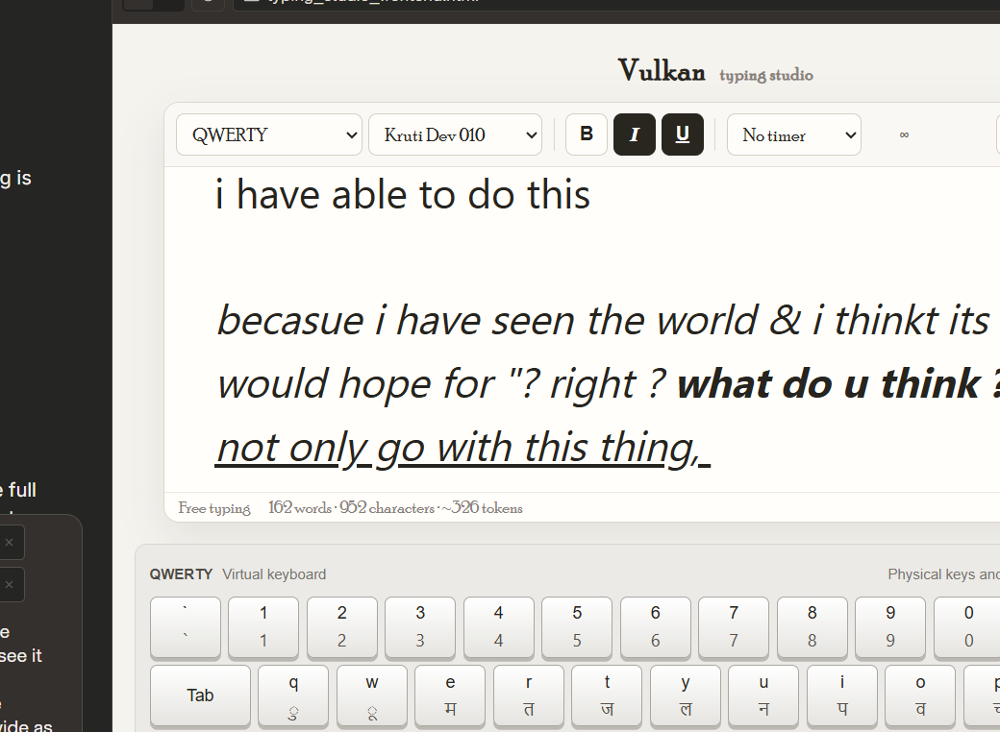

# Vulkan Typing Studio

A lightweight, offline-first English and Hindi typing workspace with a focused editor, animated virtual keyboard, timed sessions, safe rich-text emphasis, and a character-by-character **Keys Buster** mode.



> **Project status:** V7 functional prototype. Suitable for personal practice and evaluation; not yet a certified government-exam engine or production desktop installer.

## Why Vulkan?

Vulkan is designed around a quiet typing surface rather than a dashboard. Its current differentiators are:

- single-file offline release
- no account, ads, telemetry, or network requests
- English and Unicode Hindi practice
- QWERTY, AZERTY, QWERTZ, Dvorak, InScript, Remington, and Chanakya-oriented profiles
- animated physical/virtual keyboard synchronization
- focus-mode ribbon and caret-follow scrolling
- safe bold/italic/underline paste without images or embedded content
- Keys Buster moving-key exercise mode
- timed results with WPM, accuracy, and consistency

## Try it

### Directly

Download or clone the repository, then open:

```text
index.html
```

No server or build step is required.

### Windows

```text
release/start_windows7.bat
```

### Linux

```bash
chmod +x release/start_linux.sh
./release/start_linux.sh
```

### GitHub Pages

The repository root contains `index.html`, so GitHub Pages can publish it directly from the default branch/root folder.

## Current defaults

- Layout: **QWERTY**
- Typing profile: **Kruti Dev 010**
- Timer: **No timer**
- UI font: **Poor Richard**, with Georgia fallback

Font files are not bundled. The actual font must be installed on the user’s system.

## Feature summary

### Editor

- Autofocus and caret-follow scrolling
- Bold, italic, and underline
- Safe rich paste preserving only text emphasis and line structure
- Image/embed/script rejection
- Live words, characters, and approximate token count
- Independently resizable typing panel

### Virtual keyboard

- Physical key animations
- Clickable keys
- Caps Lock and Shift behavior
- Multiple Latin and Hindi-oriented layouts
- Independently resizable keyboard panel

### Focus experience

- Ribbon fades while typing
- Ribbon returns on hover, `Esc`, or three seconds of inactivity
- Page and panel scrollbar thumbs fade when idle and return on interaction

### Timer and results

Presets from 30 seconds to 15 minutes plus custom durations up to three hours. The timer starts on the first typing attempt—not on focus.

Results include:

- words typed
- net WPM
- consistency
- accuracy

### Keys Buster

- Paste a Hindi or English exercise
- Large center target with moving adjacent keys
- English physical-key hint under the current Hindi target
- Every attempt advances
- Incorrect attempts are recorded
- Backspace is disabled
- Completion opens a result report

Automatic exercise profile:

- Devanagari text → Kruti Dev/Remington emulation
- Other text → Georgia/QWERTY behavior

## Technology

Vulkan currently uses:

- HTML5
- CSS3
- vanilla JavaScript
- native browser DOM, Selection, Range, Clipboard, Pointer, and Dialog APIs

It has:

- **0 runtime dependencies**
- **0 network requests**
- **0 external HTTP resources**
- **0 telemetry/storage APIs**

Measured V7 standalone footprint:

- 42,291 bytes uncompressed
- 12,549 bytes gzip-compressed

## Important Hindi/font note

A font is not an input method.

- Mangal and Nirmala UI are Unicode Devanagari fonts.
- Kruti Dev 010 and Chanakya are legacy font/encoding families.
- Vulkan stores Hindi as Unicode and emulates physical key mappings.
- It does **not** yet export certified legacy-encoded Kruti Dev or Chanakya documents.
- Complex conjuncts, matras, and multi-code-point sequences still need a grapheme/input-sequence engine before exam-grade scoring is possible.

Read the full [Transparency Report](docs/TRANSPARENCY_REPORT.md) before using scores for formal decisions.

## Testing

The repository contains reproducible static, mapping, and DOM smoke audits.

```bash
npm install
npm test
python audit/static_audit.py index.html
```

Captured V7 result: **23/23 functional smoke checks passed**.

This does not replace real-browser testing on Windows and Linux. See the report for the untested matrix.

## Repository layout

```text
.
├── index.html                         # GitHub Pages / direct-run app
├── src/app.js                         # Reviewable JavaScript source
├── release/
│   ├── Vulkan-Typing-Studio-Standalone.html
│   ├── start_windows7.bat
│   └── start_linux.sh
├── assets/vulkan-preview.png
├── audit/                             # Reproducible tests and captured results
├── docs/
│   ├── USER_GUIDE.md
│   ├── TRANSPARENCY_REPORT.md
│   ├── ROADMAP.md
│   └── V7_CHANGES.md
├── .github/                           # CI and issue templates
├── LICENSE
├── SECURITY.md
├── CONTRIBUTING.md
└── CHANGELOG.md
```

## Documentation

- [User guide](docs/USER_GUIDE.md)
- [Transparency, security, performance, and market report](docs/TRANSPARENCY_REPORT.md)
- [Roadmap](docs/ROADMAP.md)
- [Security policy](SECURITY.md)
- [Contributing](CONTRIBUTING.md)
- [Changelog](CHANGELOG.md)

## Known limitations

- Browser prototype, not a signed native installer
- No saved history or personal-best charts
- No adaptive weak-key curriculum
- No formal accessibility certification
- No exact model tokenizer
- Free-typing accuracy is correction-based, not target-based
- Formatting still relies on deprecated `document.execCommand`
- Complex Hindi sequence scoring is not yet authoritative
- Windows 7 browsers/webviews are end-of-life and should be used offline only

## Packaging direction

The likely path is:

1. Keep the standalone HTML release.
2. Use Tauri for supported modern Windows/Linux builds.
3. Treat Windows 7 as a separately tested legacy target.
4. Consider Qt 5.15 if a dependable legacy Windows build cannot be achieved with WebView2/Tauri.

## License

Licensed under the [Apache License 2.0](LICENSE).

Apache-2.0 permits private, commercial, and open-source use while including an explicit patent grant and contributor protections. Font files and font licenses are separate; no third-party font binaries are included here. See [Third-Party Notices](THIRD_PARTY_NOTICES.md).
